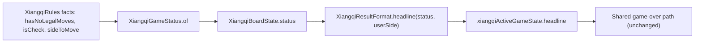

# OB-047: Xiangqi game end

The shared game-over path is driven entirely by `ActiveGameState.headline`:
- `SuggestionController._idleState` returns `SuggestionGameOver` before tier gating;
- `TopBar` and `turn_status` read `isOver`;
- the card renders `headline.lines` and `headline.tone`.

The Xiangqi board already blocks taps and dims everything via `XiangqiBoardState.isOver`. Today `xiangqiActiveGameState` leaves `headline` null, so the only missing piece is supplying that headline.

## 1. Domain (`lib/features/xiangqi/domain/`)
- New `xiangqi_game_status.dart`, mirroring [lib/features/chess/domain/chess_game_status.dart](lib/features/chess/domain/chess_game_status.dart):
  - `sealed class XiangqiGameStatus` with `bool get isOver` and `static XiangqiGameStatus of(XiangqiRules rules)`.
  - `XiangqiInProgress`.
  - `XiangqiLoss({required PlayerSide winner, required XiangqiEndReason reason})`, where `enum XiangqiEndReason { checkmate, noMoves }`.
  - `of` returns `XiangqiInProgress` unless `rules.hasNoLegalMoves`. Otherwise the winner is `sideToMove.opposite` and the reason is `checkmate` if `rules.isCheck`, else `noMoves`. There are no draw or repetition branches (XQ6, XQ9).
  - Value equality and `toString`, as in the Chess classes.
- New `xiangqi_result_format.dart`: `XiangqiResultFormat.headline(XiangqiGameStatus status, PlayerSide userSide)` returns `GameResultHeadline?`.
  - Null while in progress.
  - Otherwise `'CHECKMATE — YOU WIN'` / `'CHECKMATE — YOU LOSE'` / `'NO MOVES — YOU WIN'` / `'NO MOVES — YOU LOSE'`, with `ResultTone.win` or `ResultTone.loss` (BR-002, BR-003).
  - There is no `hint` (REQ-005).

## 2. Board controller ([lib/features/xiangqi/presentation/xiangqi_board_controller.dart](lib/features/xiangqi/presentation/xiangqi_board_controller.dart))
- `XiangqiBoardState`: replace the `isOver` field with `final XiangqiGameStatus status` (default `const XiangqiInProgress()`) and add `bool get isOver => status.isOver`. Existing call sites and tests keep working.
- `_snapshot` computes `XiangqiGameStatus.of(_rules)` once. Because it runs on every snapshot, undo restores the status (REQ-002). `activePoints` becomes empty when `status.isOver`.
- `xiangqiActiveGameState` sets `headline: XiangqiResultFormat.headline(board.status, board.userSide)` and drops the "comes with OB-047" comment.
- No other files change: there is no shared widget or registry change (REQ-004).

## 3. Tests
- Unit tests in `test/features/xiangqi/domain/`:
  - `xiangqi_game_status_test.dart`, built from FENs:
    - checkmate with each side to move, e.g. the existing `'R3k4/1R7/9/9/9/9/9/9/9/3K5 b - - 0 1'` plus a Red-mated mirror;
    - a flying-general mate;
    - no moves (not in check) for each side, e.g. the existing `'4k4/9/6N2/9/9/3R1R3/9/9/9/3K5 b - - 0 1'` plus a mirror;
    - in progress: the start position and generals only.
  - `xiangqi_result_format_test.dart`: all four headlines and tones from each user side, and null in progress.
- Controller tests (extend [test/features/xiangqi/presentation/xiangqi_board_controller_test.dart](test/features/xiangqi/presentation/xiangqi_board_controller_test.dart)):
  - a mating `commitEngineMove` gives `XiangqiLoss` and a headline, and everything goes inactive;
  - undo restores `XiangqiInProgress` and active points, including several undos back to the start;
  - `xiangqiActiveGameState` exposes the headline, and `hint` is null.
- Seam and widget tests (new `test/features/advisor/presentation/xiangqi_game_over_test.dart`, with a real `GameKind.xiangqi` session on `FakeGameEngine` and overridden `xiangqiRulesProvider` FENs):
  - the opponent mates the user: `SuggestionGameOver`, and no search, also after a tier change and with no tier;
  - the user's confirmed mate shows `CHECKMATE` / `YOU WIN` in `accentGreen`, then UNDO brings back the same suggestion with no new search;
  - `NO MOVES` / `YOU LOSE` in `accentRed`;
  - repeated moves (perpetual check) and generals-only positions keep playing;
  - the top bar shows `GAME OVER` and the status line NEW GAME. The 500 ms guard and BACK are already covered by the shared `status_line_test`; one Xiangqi pump confirms the key appears.
- Integration test on the simulator, new `integration_test/xiangqi_game_end_test.dart`: the real app and engine, with `xiangqiRulesProvider` overridden to a mate-in-1 FEN (`reset` returns to that FEN, so START GAME uses it).
  - Red user with God: confirm the suggestion, then `CHECKMATE` / `YOU WIN`, dimmed board, `GAME OVER`, NEW GAME. Screenshot. UNDO brings back the same suggestion.
  - Opponent mates the Red user: enter Black's mating move on the board, then `CHECKMATE` / `YOU LOSE`. Tapping a tier starts no search. Screenshot.
  - Exact FENs are checked against `DartXiangqiRules` while implementing; candidate Red mate-in-1: `'4k4/1R7/9/9/9/9/9/9/9/R2K5 w - - 0 1'` (`a1a10`).

## 4. Wrap-up
- Check free disk space, then run `flutter analyze`, `flutter test` and all integration tests on the iOS simulator (iPhone 17 Pro).
- Add the ticket status block to [tickets/OB-047-xiangqi-game-end.md](tickets/OB-047-xiangqi-game-end.md), update its row in [tickets/README.md](tickets/README.md), and add an entry to [memory-bank/activeContext.md](memory-bank/activeContext.md).
